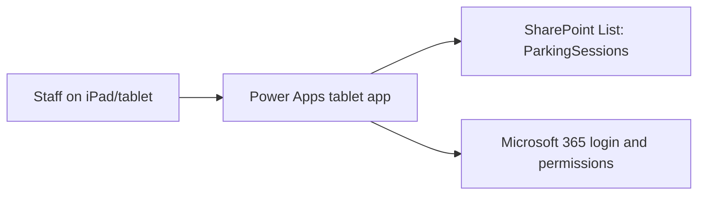

# Power Apps Parking Bay Register

Private Microsoft 365 parking bay register for bays 1 to 10, designed for iPad/tablet use.

Staff open the Power Apps canvas app, tap a bay, enter the person's name and car registration, then check the car out when it leaves. Parking records are stored in a SharePoint List.

## What Is Included

- SharePoint List schema for `ParkingSessions`
- Power Apps screen structure and Power Fx formulas
- Deployment checklist
- Test checklist
- Future visitor register notes, kept out of v1 scope

## Recommended V1 Architecture

## Build Order

1. Create the SharePoint List using [sharepoint/ParkingSessions.schema.md](sharepoint/ParkingSessions.schema.md).
2. Create a Power Apps tablet canvas app using [power-apps/app-structure.md](power-apps/app-structure.md).
3. Add the formulas from [power-apps/formulas.md](power-apps/formulas.md).
4. Apply permissions and sharing using [docs/deployment-checklist.md](docs/deployment-checklist.md).
5. Validate with [docs/test-plan.md](docs/test-plan.md).

## Privacy

The app should only be shared with approved Microsoft 365 users. Do not enable anonymous links or public sharing on the SharePoint site/list.

